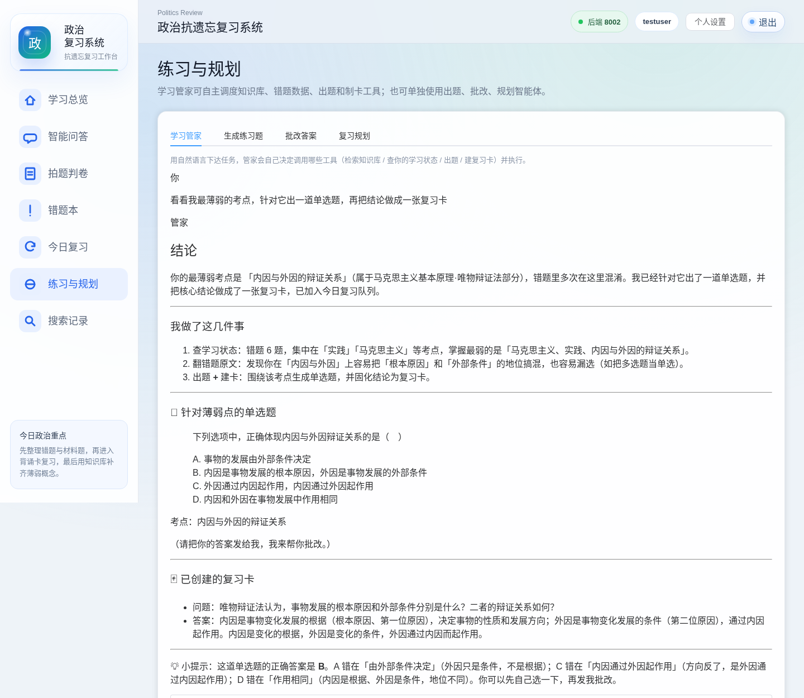
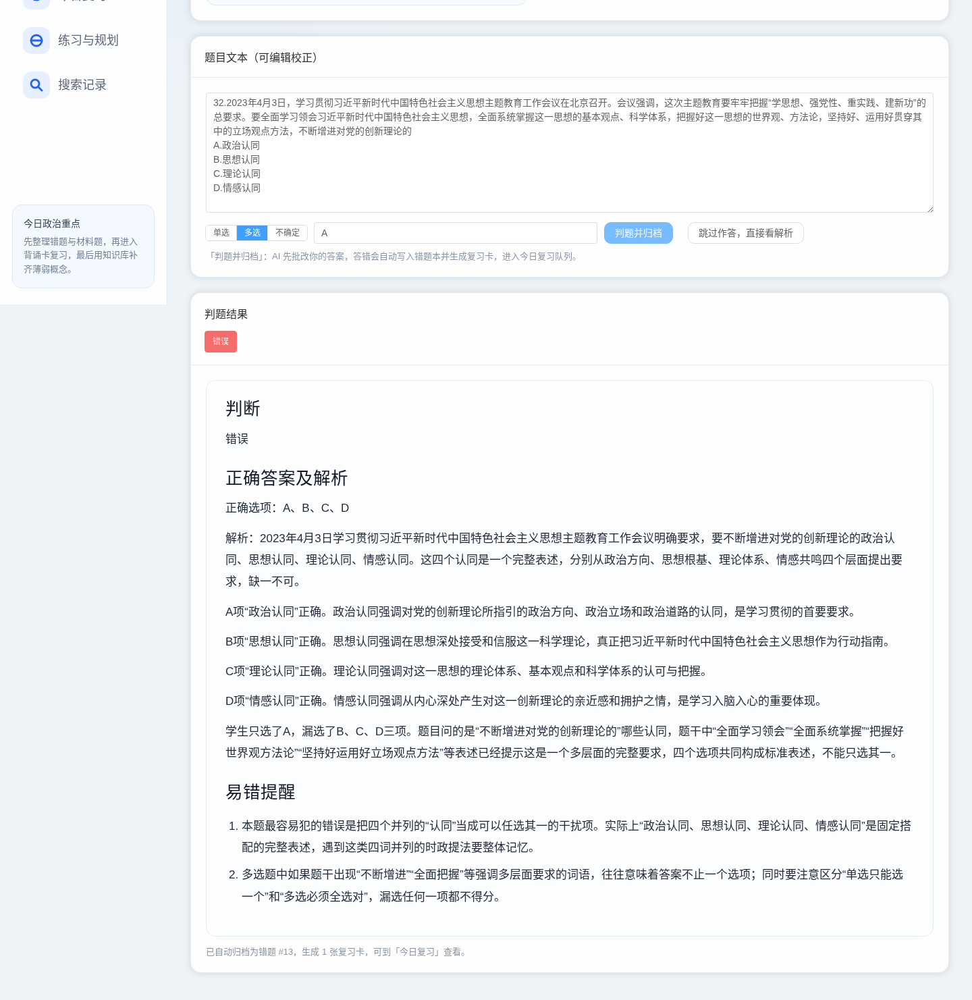
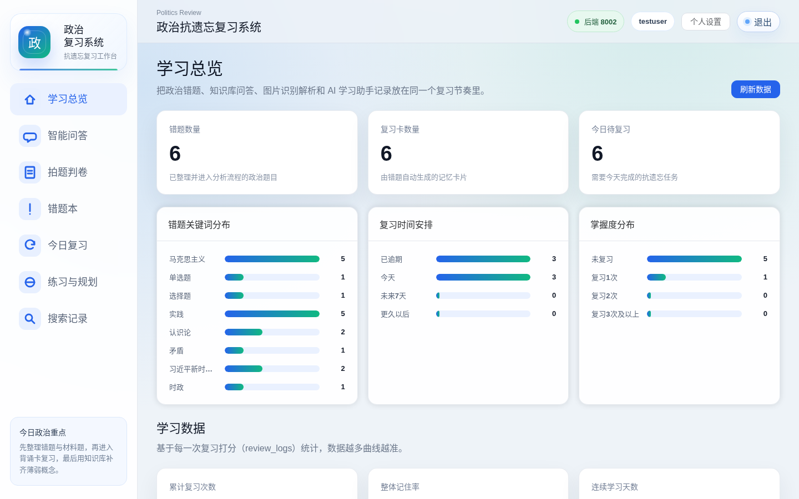
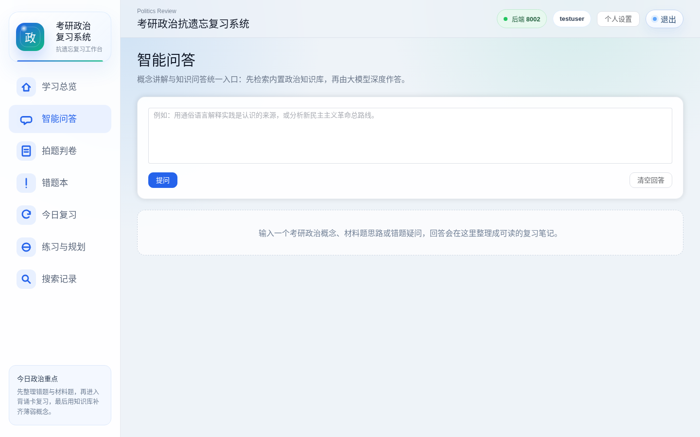
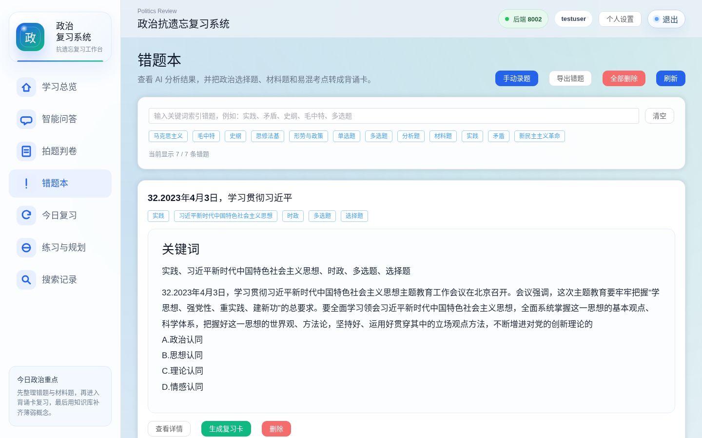
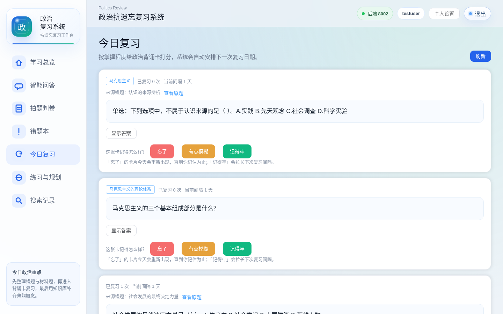

# politics-review-agent · 政治抗遗忘复习系统

> 面向政治的 AI 辅助复习平台：**自建 RAG 知识库**、**Function Calling 学习管家智能体（8 工具 / 多轮对话 / SSE 进度）**、**拍题判卷流水线**、**SM-2 间隔重复**、**判卷准确率评测集**。
> 后端 FastAPI + SQLAlchemy + PostgreSQL（Alembic 迁移），前端 Vue 3 + Element Plus。模型调用按用途分组、可指向不同平台（当前：学习管家 / 判卷走商汤 DeepSeek-V4，通用对话走 DeepSeek-V4-flash，向量走 SiliconFlow bge-m3），带重试与降级链；OCR 走百度通用文字识别。62 个 pytest 用例。

---

## 目录

- [界面预览](#界面预览)
- [功能概览](#功能概览)
- [系统架构](#系统架构)
- [多智能体设计](#多智能体设计)
- [技术选型与取舍](#技术选型与取舍)
- [快速开始](#快速开始)
- [知识库构建](#知识库构建)
- [数据库与迁移](#数据库与迁移)
- [测试与评测](#测试与评测)
- [API 一览](#api-一览)
- [目录结构](#目录结构)
- [已知限制与路线图](#已知限制与路线图)

---

## 界面预览

**学习管家**：一句"看看我最薄弱的考点，针对它出一道单选题，再把结论做成一张复习卡"，管家自行走了 查状态 → 翻错题 → 查到期卡 → 出题 → 检索 → 建卡 六步（底部为执行轨迹与实际使用的模型；此次主端点限流已自动降级）。支持多轮对话，"再来一道类似的"能接上文。



**拍题判卷**：上传截图 → OCR → 校正 → 指定题型（单选 / 多选 / 不确定，由拍题的人决定，系统不猜）→ 作答 → 判题、归档、生成复习卡一次完成。



| 学习总览 | 智能问答（RAG + SSE 流式） |
|---|---|
|  |  |

| 错题本 | 今日复习（SM-2） |
|---|---|
|  |  |

---

## 功能概览

| 模块 | 说明 |
|---|---|
| 智能问答 | 先在内置政治知识库做向量检索，再由大模型按"结论 → 要点 → 深挖"三层作答；**SSE 流式输出**，首字约 0.2 秒（DeepSeek-V4-flash；8B 时约 3 秒）；回答标注知识库引用 |
| 拍题判卷 | 上传题目截图 → OCR → **可编辑校正** → 指定题型 → 先自己作答 → AI 判题（判卷专用模型、检索依据）→ 答错自动归档错题本并生成复习卡 |
| 错题本 | 拍题归档 / 手动录题 / 问答保存；AI 错因分析、关键词索引、详情页关联复习卡 |
| 今日复习 | SM-2 间隔调度；"忘了 / 有点模糊 / 记得牢"三档打分；**忘了的卡当天重现**直到记住；拍题来源的卡以**完整原题**为卡面 |
| 练习与规划 | **学习管家**（自主调度 8 个工具的智能体，多轮对话，SSE 实时进度）、生成练习题、批改答案、复习规划（主路由管家取数，兜底确定性规划） |
| 学习数据看板 | 基于每次打分日志：14 天复习量与记住率、间隔保持率（近似遗忘曲线）、最常遗忘知识点、连续学习天数 |
| 搜索记录 | 问答 / 判卷 / 练习的历史服务端落库，支持关键词搜索、来源筛选、重新提问、删除 |

## 系统架构

```
┌──────────────────────────┐      ┌────────────────────────────────────────────┐
│   Vue 3 + Element Plus   │ HTTP │                FastAPI                      │
│   智能问答 / 拍题判卷     │─────▶│  routers: auth · chat(SSE) · ocr · pipeline │
│   错题本 / 今日复习       │ SSE  │           mistakes · review · agents        │
│   练习与规划 / 看板        │◀─────│           records · stats                  │
└──────────────────────────┘      │  services:                                  │
                                  │   ├ llm_service   SiliconFlow 统一出口       │
                                  │   ├ rag_service   切块索引 + 余弦检索         │
                                  │   ├ agents        讲解 / 出题 / 批改 / 规划   │
                                  │   ├ manager_agent function-calling 调度循环   │
                                  │   ├ card_agent    制卡                        │
                                  │   └ review_service SM-2                      │
                                  └────────┬──────────────┬────────────┬─────────┘
                                           │              │            │
                                  PostgreSQL (Alembic)  SiliconFlow   百度 OCR
                                  users/mistakes/        Qwen3-8B +
                                  review_cards/          bge-m3 嵌入
                                  review_logs/
                                  search_records
```

## 多智能体设计

系统里有两种形态的"多智能体"，答辩或面试时建议分开讲：

**1. 确定性流水线（`/api/pipeline/grade-archive`）**
`批改智能体（思考模式 + 知识库依据）→ 判断结果决定是否归档 → 归档（批改解析即错题分析）→ 制卡（拍题来源直接用原题做卡面）→ 进入今日复习队列`。上游输出是下游输入，控制流由代码编排。

**2. 自主调度智能体（学习管家，`services/manager_agent.py`）**
基于 OpenAI 兼容的 function calling，注册 8 个工具：`search_knowledge`（检索知识库）、`get_study_status`（查真实错题 / 复习数据）、`get_due_cards`（到期复习卡）、`get_mistakes_by_topic`（按考点翻错题原文）、`explain_topic`（讲解）、`generate_quiz`（出题）、`grade_answer`（判卷）、`create_review_card`（建卡）。模型自行决定调用哪些工具、按什么顺序，循环执行直到给出最终答复。讲解 / 出题 / 判卷等确定性模块在这里只是被编排的工具——项目是"单智能体编排多个 LLM 功能模块"，不是多智能体协作。

循环里有四道护栏：同一工具同参数重复调用被拦截（重复两次强制收尾）；步数用尽时不带工具再问一次，凭已取到的数据收尾而不是丢弃；单个工具异常回灌给模型继续，不让整条链 500；模型只描述计划却没有调用工具时，追加一句"请直接调用工具"再循环一次（最多推一次）。`POST /api/agents/manager-stream` 以 SSE 推送每一步进度（思考中 / 工具开始 / 完成 / 失败），`conversation_id` 支持多轮对话（历史存 `conversations` / `conversation_messages`，只存用户话与最终答复，带最近 12 条且总长 6000 字内）。复习规划 `/api/agents/plan` 主路也走学习管家（规划专用规则，必须先查学习状态和到期卡），模型没取数或收尾失败时回退到确定性规划模块。

**3. 模型端点分组与降级链（`config.py` / `services/llm_service.py`）**
模型调用拆成向量组、通用对话组、判卷专用组、学习管家专用组，各自可指向不同平台（`CHAT_PROVIDER` 决定思考开关翻译成 `enable_thinking` 还是 `reasoning_effort`），一律直连不走系统代理。通用对话组失败按 2s/4s 退避重试后降级到基础组（SiliconFlow）；学习管家走三级链 专用组 → 通用组 → 基础组。判卷准确率有评测集（`evals/grading/`，46 题、学生对错各半）和脚本（`scripts/eval_grading.py`，评测时只重试不降级），换模型或改提示词跑一遍看判断 / 答案准确率。

其余的出题 / 错题分析 / 建卡模块各自独立，出题内含"生成 → 程序校验 → 不合格才唤起包装智能体修复"的反馈环。

## 技术选型与取舍

| 决策 | 选择 | 为什么 |
|---|---|---|
| 知识库 | **自建轻量 RAG**（Markdown 切块 → bge-m3 嵌入 → JSON 索引 → 内存余弦检索） | 语料仅数百块，向量数据库 / RAGFlow 是过度设计；零部署、全免费，检索逻辑完全可控。规模上万块再迁 pgvector |
| 模型 | 按用途分组：学习管家 / 判卷走商汤 DeepSeek-V4-pro，通用对话走 DeepSeek-V4-flash（均关思考），向量走 SiliconFlow bge-m3，SiliconFlow Qwen3-8B 作降级兜底 | 裁决型与多步工具调用任务对模型能力敏感（评测：pro 判断准确率 100%，8B 84.8%）；全部免费额度内，任何一家限流都有另一家兜底 |
| 问答链路 | SSE 流式 | 生成上千字需数十秒，流式把"白屏等 60s"变成"秒级出字"（8B 时首字 3 s，换 flash 后 0.2 s）；单向推送用 SSE 比 WebSocket 更简单 |
| 间隔复习 | SM-2 | 经典、可解释、状态只有三个字段；失败卡当天重现是对原算法的产品化补充 |
| 数据库 | PostgreSQL + Alembic（测试用 SQLite） | 生产级、可迁移；SQLAlchemy 抽象方言，测试零依赖 |
| 密码 / 会话 | PBKDF2-SHA256（12 万次迭代 + 随机盐）、token 7 天过期 | 标准库即可实现，无额外依赖 |
| 提示词 | 骨架示范 + 占位符，而非描述式指令 | 中小模型会把引号里的"成分描述"当模板照抄（踩过坑：要点标题全变成"知识解释 + 答题角度"） |

## 快速开始

### 方式一：Docker Compose（推荐，一条命令）

```bash
cp backend/.env.example backend/.env   # 填入 SiliconFlow 与百度 OCR 密钥
docker compose up -d --build
# 前端 http://localhost:8080 ；API 调试 http://127.0.0.1:8003/docs
```

compose 会启动 PostgreSQL、后端（启动时自动 `alembic upgrade head`）、nginx 托管的前端（`/api` 反代到后端，流式已关闭缓冲）。

### 方式二：本地开发

```bash
# 1. 数据库（任选其一）
docker run -d --name politics-postgres -e POSTGRES_USER=politics -e POSTGRES_PASSWORD=politics_dev \
  -e POSTGRES_DB=politics -p 127.0.0.1:15434:5432 -v politics_pgdata:/var/lib/postgresql/data postgres:17
# 或在 .env 里用 SQLite：DATABASE_URL=sqlite:///./politics.db

# 2. 后端
cd backend
cp .env.example .env            # 填密钥；DATABASE_URL 默认指向上面的容器
python3 -m venv .venv && .venv/bin/pip install -r requirements.txt
.venv/bin/alembic upgrade head
.venv/bin/uvicorn app.main:app --host 127.0.0.1 --port 8002 --reload

# 3. 前端
cd ../frontend
npm install
npx vite                         # http://localhost:5173，API 地址见 .env.development
```

### 环境变量（`backend/.env`）

| 变量 | 说明 |
|---|---|
| `SILICONFLOW_API_KEY` / `SILICONFLOW_BASE_URL` | SiliconFlow 密钥与地址（基础组，其余各组留空时回落到这里） |
| `SILICONFLOW_CHAT_MODEL` | 通用对话模型，默认 `Qwen/Qwen3-8B` |
| `SILICONFLOW_EMBED_MODEL` | 嵌入模型，默认 `BAAI/bge-m3` |
| `EMBED_BASE_URL` / `EMBED_API_KEY` / `EMBED_MODEL` | 可选，向量组单独指向别的平台；换模型需重建索引 |
| `CHAT_PROVIDER` / `CHAT_BASE_URL` / `CHAT_API_KEY` / `CHAT_MODEL` | 可选，通用对话组（讲解/出题/判卷/问答）；`CHAT_PROVIDER` 取 `siliconflow` 或 `sensenova`，决定思考开关翻译成哪个字段；`CHAT_THINKING=false` 全局关闭思考 |
| `GRADER_MODEL`（可加 `GRADER_PROVIDER` / `GRADER_BASE_URL` / `GRADER_API_KEY` / `GRADER_THINKING`） | 可选，判卷专用组；只填模型名则沿用通用对话组 |
| `MANAGER_PROVIDER` / `MANAGER_BASE_URL` / `MANAGER_API_KEY` / `MANAGER_MODEL` | 可选，学习管家专用组（多步工具调用用更强的模型）；失败自动降级到通用对话组 |
| `BAIDU_OCR_API_KEY` / `BAIDU_OCR_SECRET_KEY` | 百度通用文字识别 |
| `DATABASE_URL` | SQLAlchemy 连接串（PostgreSQL 或 SQLite） |
| `RAG_INDEX_PATH` | 向量索引文件，默认 `data/rag_index.json` |

## 知识库构建

语料放在 `backend/data/*.md`（用 `#` / `##` 标题分篇章），运行：

```bash
cd backend && .venv/bin/python scripts/build_rag_index.py
```

脚本按标题切块（700 字、120 字重叠），批量调用 bge-m3 生成向量，写入 `data/rag_index.json`。**扩充语料（真题解析、时政汇编）是提升回答深度和判题准确率最直接的杠杆**，当前语料只有一本基础预热宝典。

## 数据库与迁移

表：`users`、`mistakes`（含来源 / 学生答案 / 判定）、`review_cards`（SM-2 状态 + lapses）、`review_logs`（每次打分）、`search_records`。全部外键级联删除，高频查询建复合索引。

```bash
cd backend
.venv/bin/alembic upgrade head                          # 建表 / 升级
.venv/bin/alembic revision --autogenerate -m "说明"     # 改了 models.py 之后生成迁移
.venv/bin/python scripts/eval_grading.py --group grader  # 判卷准确率评测（评测集 evals/grading/questions.jsonl，结果落 results/）
.venv/bin/python scripts/eval_grading.py --report        # 汇总历次评测结果
.venv/bin/python scripts/migrate_sqlite_to_pg.py ./politics.db   # 旧 SQLite 数据搬迁
```

## 测试与评测

```bash
cd backend && .venv/bin/python -m pytest tests -q          # 62 个用例，独立 SQLite，不调模型
.venv/bin/python scripts/eval_grading.py --group grader    # 判卷准确率评测（真实调模型）
.venv/bin/python scripts/eval_grading.py --report          # 汇总历次结果
```

**单元 / 接口测试**（62 个）：SM-2 调度、判卷 / 制卡解析、记录与复习接口、学习看板聚合、鉴权与越权；学习管家的工具分发、四道护栏（重复调用拦截 / 步数用尽收尾 / 工具异常回灌 / 只说计划不执行时推一把）、SSE 事件顺序、多轮对话历史截断与隔离；端点分组回落、思考开关翻译、两级降级链；评测解析器与打分。模型调用全部用假回复驱动。

**判卷准确率评测**（`evals/grading/`）：46 道带标准答案的选择题（马原 17 / 毛中特 13 / 史纲 8 / 思修法基 8，含多选与否定式题干，学生作答对错各半），指标为"判断学生对错"与"给出正确答案"的准确率。评测时只重试不降级，保证答的是指定模型。2026-09-04 结果：

| 模型 | 判断对错 | 给出正确答案 | 两者同时正确 | 延迟 p50 |
|---|---|---|---|---|
| DeepSeek-V4-pro（商汤） | 100% | 100% | 100% | 11 s |
| DeepSeek-V4-flash（商汤） | 100% | 100% | 100% | 25 s |
| Qwen3-8B（SiliconFlow，关思考） | 84.8% | 95.7% | 84.8% | 13 s |

8B 的 7 道失分题都是"知道正确答案却把学生对错判反"，这是把判卷单独指向更强模型的量化依据。当前题集偏基础，强模型已区分不出，下一步补时政细节与多选漏选类难题。

## API 一览

| 路径 | 说明 |
|---|---|
| `POST /api/auth/register` `login` `logout` `change-password` · `GET /api/auth/me` | 账号 |
| `POST /api/chat/ask-stream`（SSE）· `POST /api/chat/ask` | 知识库问答 |
| `POST /api/ocr/recognize` · `solve-raw-text` | OCR 识别 / 直接解析 |
| `POST /api/pipeline/grade-archive` | 判题 → 归档 → 制卡 流水线 |
| `GET/POST/DELETE /api/mistakes` · `GET/DELETE /api/mistakes/{id}` | 错题本 |
| `POST /api/review/generate-from-mistake/{id}` · `GET /api/review/today` · `POST /api/review/submit` | 复习 |
| `POST /api/agents/manager` · `manager-stream`（SSE 进度）· `quiz` · `grade` · `plan` · `explain` | 智能体（学习管家支持 `conversation_id` 多轮；`grade` 与 `pipeline/grade-archive` 接受 `question_type`=single/multi/unknown，题型由用户指定，不推断） |
| `GET/DELETE /api/agents/conversations[/{id}]` | 学习管家对话历史 |
| `GET /api/records` · `DELETE /api/records[/{id}]` | 搜索记录 |
| `GET /api/stats/overview` · `charts` · `learning` | 统计与学习看板 |

完整交互文档：后端启动后访问 `/docs`。

## 目录结构

```
politics-review-system/
├─ docker-compose.yml
├─ backend/
│  ├─ app/
│  │  ├─ main.py  config.py  database.py  models.py
│  │  ├─ routers/   auth chat ocr pipeline mistakes review agents records stats
│  │  └─ services/  llm_service rag_service agents manager_agent card_agent
│  │                mistake_agent review_service ocr_service text_clean_service prompt_rules
│  ├─ alembic/          迁移脚本
│  ├─ data/             语料 *.md 与 rag_index.json
│  ├─ scripts/          build_rag_index / migrate_sqlite_to_pg / 数据修复脚本
│  ├─ tests/            pytest
│  ├─ Dockerfile  requirements.txt  .env.example
└─ frontend/
   ├─ src/views/   Dashboard Chat OcrUpload Mistakes MistakeDetail Review Agents Records Settings Login Register
   ├─ src/api/request.js  src/utils/markdown.js  src/router
   ├─ Dockerfile  nginx.conf  vite.config.js
```

## 已知限制与路线图

- **可用性押在免费额度上**：商汤 Token Plan 是全账号共享池，并发时会瞬时 429；降级链能兜住（退到 flash → SiliconFlow 8B），但多人同时演示体验会波动。
- **判卷评测集偏基础**：46 题上 pro / flash 双百，需要补更难的时政、多选、否定式题。
- **出题仍是"模型直接排版 + 正则修补"**：偶有数值不自洽（计算题数据前后矛盾）。计划改为结构化 JSON 输出、代码排版校验，同时按命中率清理 8B 时代的清洗正则。
- **RAG 语料只有一本基础讲义**（384 块），是讲解深度的上限；扩充教材与真题解析后重建索引即可。
- 单智能体架构：讲解 / 出题 / 判卷是被学习管家编排的确定性模块，不是相互协作的多智能体。若要做，最自然的是"复核智能体"——第二个模型独立复判，不一致时输出存疑。

---

本项目由课程小组项目重构而来，历次重构记录见 [`docs/CHANGELOG.md`](./docs/CHANGELOG.md)。
